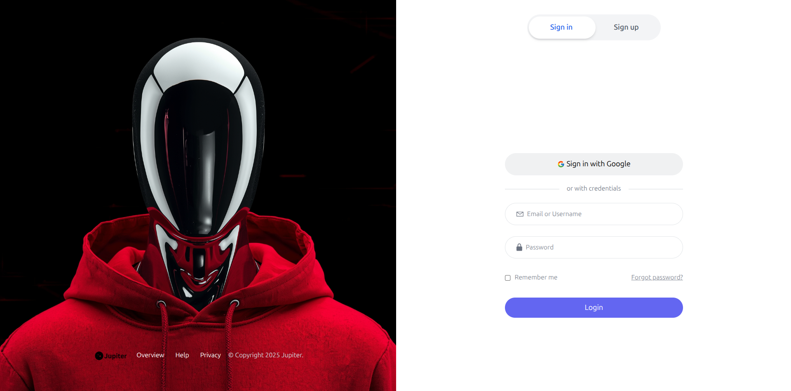
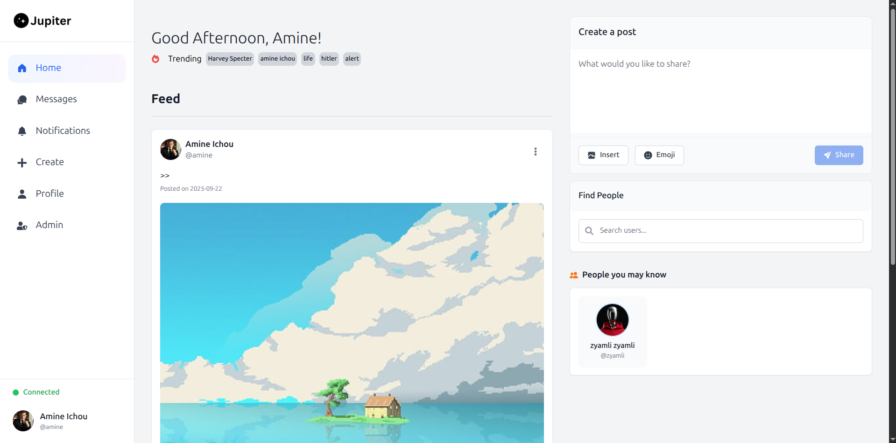
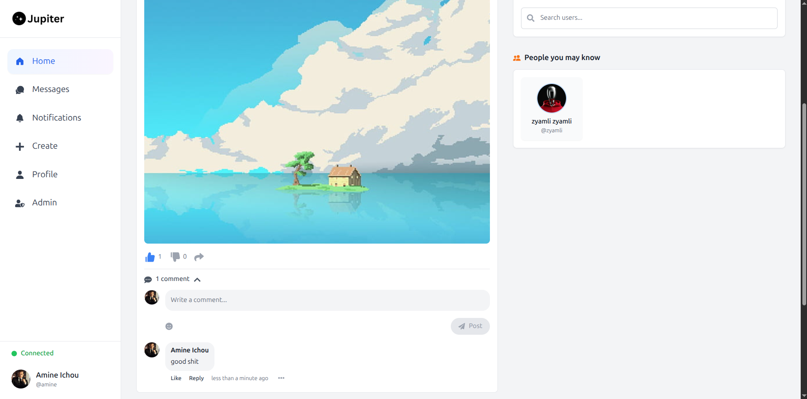
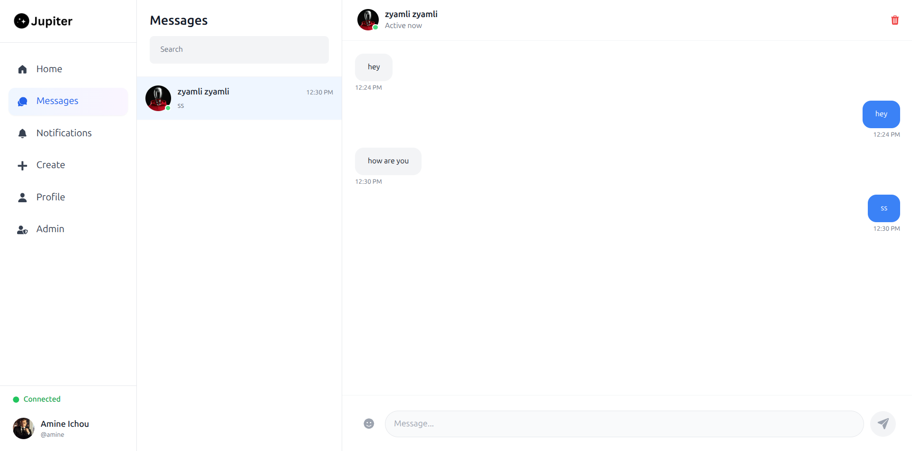
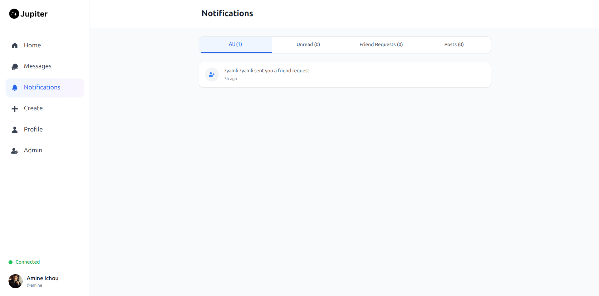

## About

This is a full-stack social media application built with:

- Frontend: React and TailwindCSS

- Backend: Express.js and SQLite

- Realtime: Socket.IO for live interactions

#### Features

- Realtime post sharing — new posts appear instantly

- Realtime chat messaging between users

- Realtime notifications for likes, comments, and messages

- Likes and comments on posts

- User authentication with JWT

This project demonstrates how to integrate a modern frontend with a lightweight backend and add realtime features for a fully interactive social experience.


## Run the Project

1. Configure Environment Variables

Create a .env file inside the backend/ folder:
```env
DATABASE_FILE=./db/db.sqlite
JWT_SECRET=your_secret_key
PORT=4000

ADMIN_USERNAME=admin
ADMIN_EMAIL=admin@admin.com
ADMIN_PASSWORD=admin@1234!
ADMIN_FIRST_NAME=admin
ADMIN_LAST_NAME=admin
```

2. Start the App with Docker

From the root of the project, run:
```sh
docker compose up
```

This will:

- Build the frontend, backend and nginx images

- Start all required containers

- Make the app accessible at http://localhost

3. (Optional) Run in Detached Mode
```sh
docker compose up -d
```

Stop containers with:

```sh
docker compose down
```






